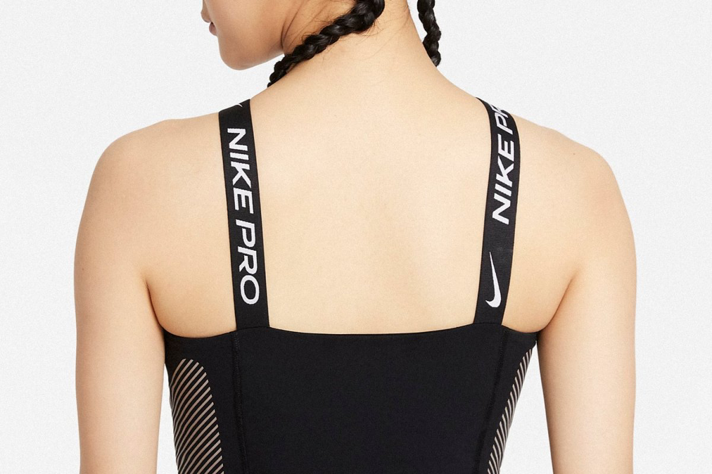

# Nike (Analyze)
Despite the fact that it doesn't have its own tone, voice and style on the website, I chose the ***Nike*** brand that every one of us meets every day.

## Voice
Although the Nike brand is considered more of a lifestyle brand lately, its main focus is still sports. That's why their Voice is primarily motivational and tries to show what can be done with their products. That and says its claim: **Just do it!**

[/cdn.vox-cdn.com/uploads/chorus_asset/file/14448800/Serena_Williams_Twitter_85680.jpg)

## Tone
Separate Tone builds on Voice and deepens the motivation, showing friendship to all its customers, both in sports and lifestyle. In their Tone we can also find a lot of inspiration that will appeal to everyone.

## Style
Their style is the most striking of the three categories, they try to keep it simple. Just like Apple does. They say things in the simplest way possible. They don't use excessive stylization, they use visually very simple fonts and simple photos.

## Interesting fact
Did you know that one of the fonts that Nike uses on its clothing was created by a Czech typefoundry?  

It is called *Pano* and you can find it [here!](https://heavyweight-type.com/fonts/pano/detail)