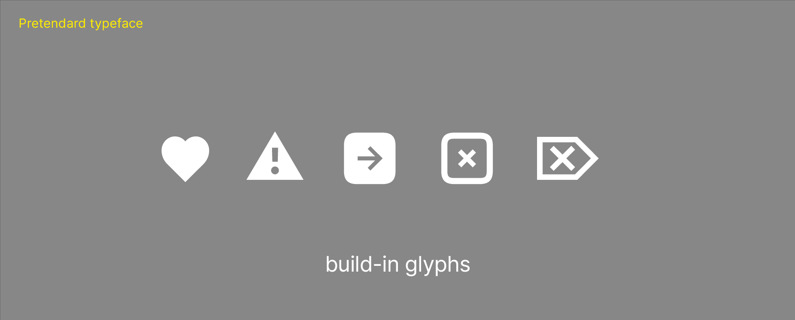

# Voice, Tone & Style

## Voice
#### Dry humour
Is it possible to have other than *dry humor* in something that is professional? Probably not!
#### Facts
The profession is about facts and it doesn't matter if it's animation, graphic design or programming. **Facts are important** and it's not good to suppress them.
#### Simple form
Keeping the writing simple makes the **text easier to read and clearer**. The text is also easier to manipulate and make any edits.

## Tone
#### Share
Sharing information **is important** in the world, and that's what I stick to, whether it's facts or personal experience. I think it's important to base writing on them.

#### Fun
There's no harm in adding a bit of fun to your style. It doesn't all have to be boring facts, even if it is dry humor.

#### Serious
Although I add fun, there is always just a little bit of it, the important thing is to be serious and confident in my claims.

## Style
#### Stylize writting
Text styling using **bold** or *italics* cuts is a basic text modification that can be used across apps and emails, so why not use it! 
#### Use glyphs and technologies from used font
Fonts contain various symbols such as an arrow or a heart, why not use those too? It's personal and nobody does it.
If there is a use of variable font, *why not animate the axes*?