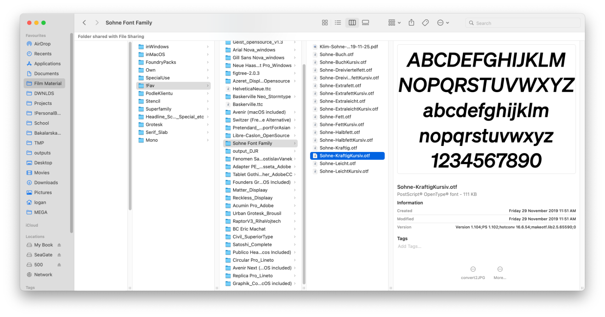

# Headline (Storytelling)

Formats:
[Offline](presentation/storytelling.pdf) 

## Introduction
We all have a hobby or obsession that we enjoy. Someone collects stamps, someone collects lego sets. I collect fonts, and I'd call it a mania. Why? You'll find out in this storytelling.

## Begginning
Where did it begin? We can say that in my early days of digital graphics. Here I thought that the typeface is what sets the direction of the graphic and changes its mood and character.

*an example of one of my first downloaded fonts (with terrible kerning)*

## The problem
In one of my graphic works, I started to realize that the fonts I have *are not good*. On the other hand, I started to expand my knowledge of typography and **started to create a library** that contains fonts that are well designed, have good kerning and diacritics (which is usually a problem in Czech & Slovak).
*screenshot of my typo library*

*Example of bad kerning in wildy used typeface Inter*

When I started collecting fonts, I began to dream of an ideal font that I could use universally, had a neutral visual language, and was easy to read. So I began to search and expand my library.
*My morning routine is to make coffee and check out new applications of different fonts. I have the purple underlined ones in my library.*

## I found it
I've tried many fonts over the years that entertained me for a while and then stopped. Whether it's **Graphik** by CommercialType or **Satoshi** by ITF.  

For myself I have found a solution, the ideal font that is this versatile and readable is **Arial**. If only because everyone has it on their computer and everyone is used to reading it.

Do you think anyone will notice the difference between *Arial and Helvetica*? Probably not. And the new version of Arial, Arial Nova, is a really good font that no longer suffers from flaws (only the condensed version have bad diacritics).

## Recommendations
And what can I recommend? **Never look for the perfect typeface!** Instead, use the ones that come with your Mac, which are high quality from typefoundries all over the world. I like to use them!

*Some of the pre-installed quality fonts on Mac*