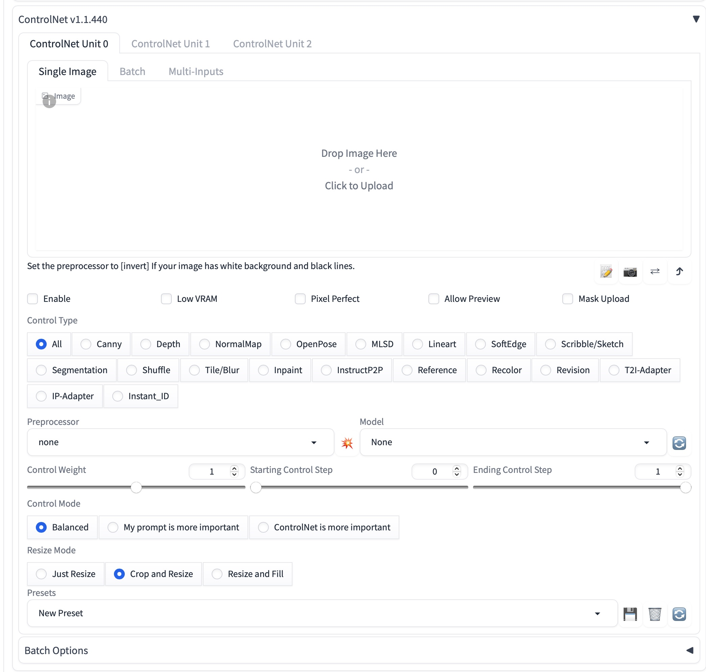

# Thesis

[offline](presentation/myThesis.pdf)

## Introduction
As you know, I'm a little nerdy. And that's why, before the end of last school year, I came up with the idea of creating a new user interface for AI generating images.

#### Why?
If you're asking why, it's simple. Although there are many user interfaces for various forms of AI, but none are made for visual design professionals.

#### Summer and the beginning...
Last summer an article was written about my planned thesis and there was **no turning back**.

*Screenshot of an [article](https://readymag.website/udrzitelnecesko/4373984/4/) from the magazine Udržitelné česko*

So after that, I started working on my thesis and thinking about how I could bring a tool to professionals that they can use.

#### But I am Graphic Designer
There were two things that were in the way - the fact that **I'm a graphic designer and not a programmer**. And that there is **not enough time** to create a tool that can be used in a similar way to *Photoshop*, *Affinity Photo* or popular *Canva*.

So I decided to base my tool on web technologies that I understand myself. This also allowed me to make a multi-platform application that can be run on macOS, Windows and Linux.

## Process
#### Main problem
The main problem is that the applications that users could use for them are not created by the designer, but also the user interface is created by programmers. Because of this, users turn to simple options with minimal features or don't use AI at all.
#### Research
The first thing I did was research current products. Here I found the different user interfaces that users are using.
This was important not only for tweaking bad design decisions, but also for creating new features.

*an example of Stable Diffusion UI, Automatic1111 webui*

*a terribly looking ControlNet panel*

## What I made?

#### Custom design system
For this application I have designed my own design system, which is created to work with images and AI.

Part of this design system and the creation of new features included the process of creating new icons.

*Some of icons from design system*

And of course, it was important to come up with a colour palette that would be used in the app.

*Color pallete of design system*

It was chosen to not only be neutral, but to handle both light and dark modes.

The whole UI is full of micro animations that give the user a better feeling of interaction.

#### Product
The result of my work is a functional frontend for Stable Diffusion, which has advanced features for generating and editing images.

*ScreenShot of KliK*

As you can see, the UI is familiar, but there are lot of features that your favorite app does not have.

Like this slider, which sets the importance of a part of the prompt.

Or this tool called PromptBuilder. PromptBuilder allows unfamiliar users to create prompts. 

There is also quick selection tool for quick improvements.
#### Naming & brand
As you may know, some artists and designers do not approve of using AI. Maybe it's also because the tools don't feel friendly. This is also the reason why I named the App **KliK**, which sounds the same as the English Click and is a translation.

*Logo of KliK*

For the visual identity, a visual style was designed that shows in 3D how to use the application.

*Showcase of visual language*

This visual style is also shown in a separate application, for example as a tooltip.

#### Did you spot it?

*[You can see KliK in the feed of PSCC's instagram!](https://www.instagram.com/p/C522Z7LI3-U/)*

So what is the future of AI? #LessTextMoreKlik!