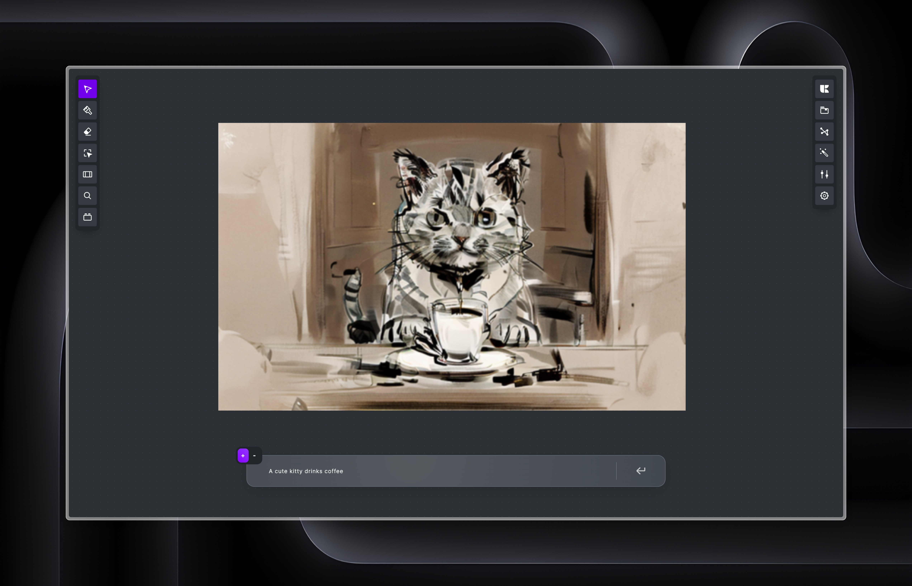
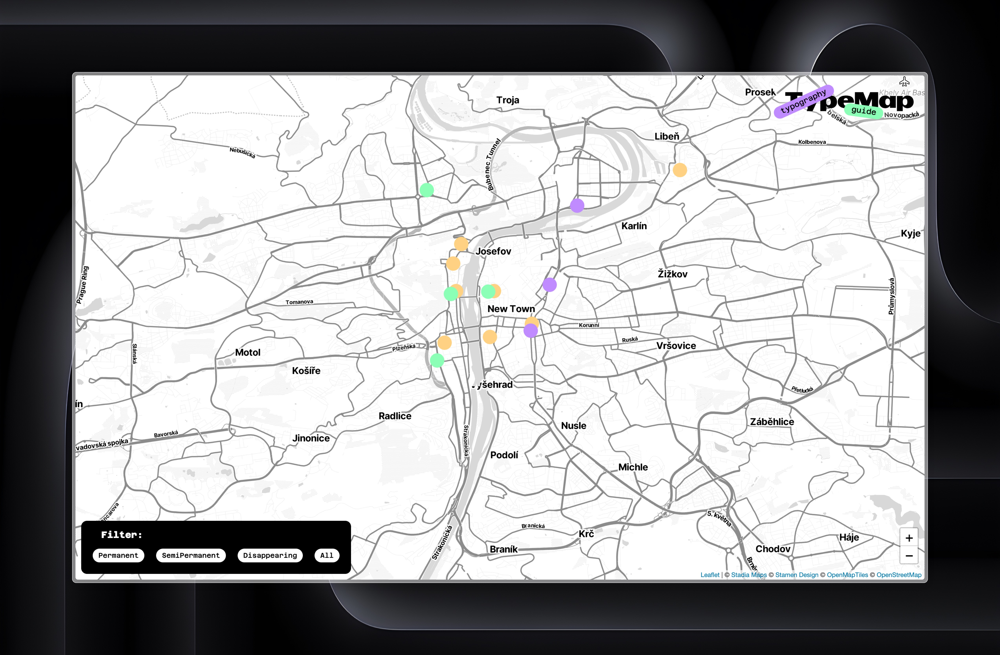

# Year in review
The last 12 months have been very short for me and many things have happened. From positive to negative. Still, this year is a turning point, not only because I am finishing my final thesis, but also because it is gradually starting to show who I really am.

## What I learned?
Probably the most important thing I realized this year is that things always work out somehow and it doesn't matter if it's negative or positive. 
#### Who am I?
I've also probably found my place in design. It's always bothered me that I experiment too much and don't have one area that I'm a specialist in. Now I know that this is exactly my advantage and that I can probably **create anything** from animations, VFX, graphics, to complex desktop applications and new typefaces.

## What I did? What happend?

#### KliK
Probably the biggest thing that has happened in the last year is my thesis, which has become a big project that I plan to continue to develop. Or create other applications that will complement the software family in other fields.

#### First Flight
But many other things have happened too, like my first plane flight. That was to London, thanks to a project we created together ♥︎ with Czech School without Borders. That was repeated and I flew here a second time in the same year.

#### First use of Mluvka
During the summer and autumn I did visual effects for a series for the Nova TV channel, which was interesting not only because it was my first VFX that I did myself, but also because it was the first time I used my font → [Mluvka](https://github.com/JiriKrblich/Mluvka).

#### TypeMap
Last but not least, a lot of little things happened and thanks to various projects a lot of important things were created for me, for example TypeMap, which maps Czech and Slovak typography in Prague.

[You can find it here!](https://jirikrblich.github.io/TypeMap/)